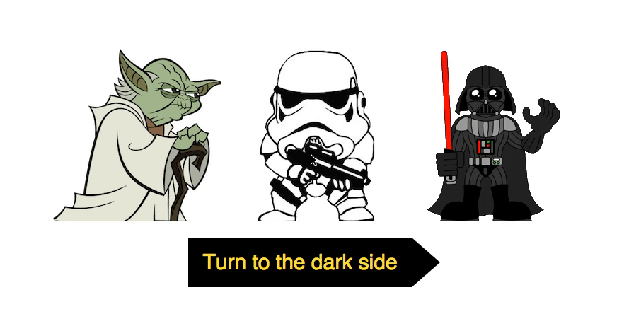
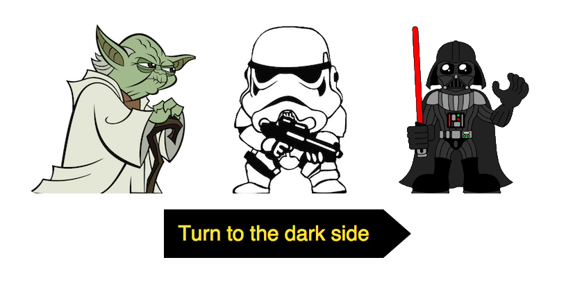
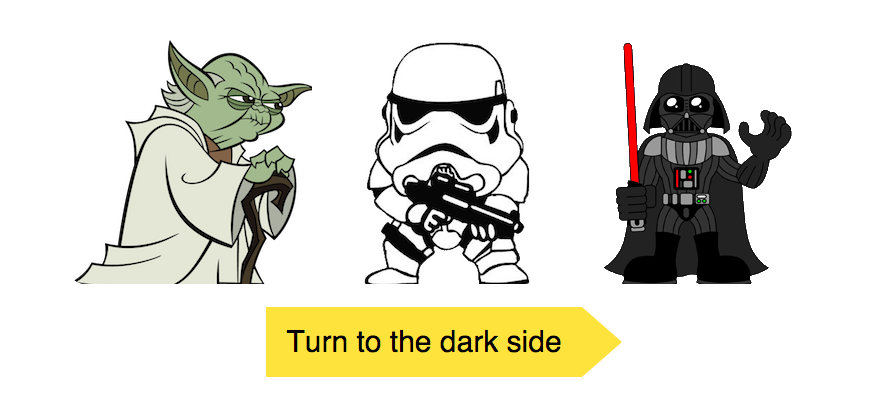
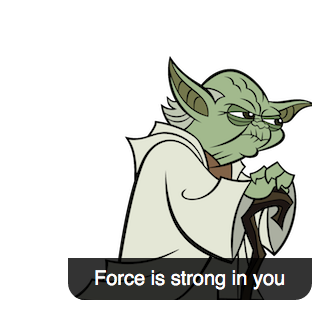
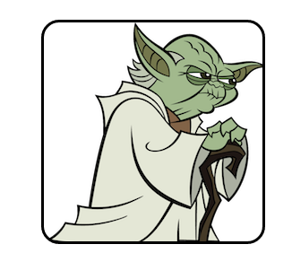

# Test de recrutement pour le poste Front-end junior dev. 

Description de la tâche:  
Dans le fichier `index.html` se trouve un simple formulaire en HTML. 
Votre travail consiste à modifier **uniquement**  les fichiers: 
`public/css/all.css` et `public/js/all.js`  qui vont modifier le design et le comportment du site. 

&nbsp;  

### Exigences pour le design

 (modifie **uniquement** le fichier `all.css`: 

 - Le formulaire doit être centrer verticalement et horizontalement. 
 - Les éléments de choix (checkbox) doivent être représenté par les illustrations `public/images`. 
 - Un élément choisis (checked) doit contenir une bordure noire de 3 pixels et les coins doivent être arrondis à 20 pixels. 
 - Au survol de la souris sur un élément de la liste, le texte qui se trouve dans l'attribut 'data-sentence' doit apparaitre, sur un fond de couleur: `rgba(0,0,0,0.8)`.
 - Le button d'envoi du formulaire doit changer de couleur et de fond. 

&nbsp;&nbsp;

Voici quelques screen représentatifs: 

(si les captures ne fonctionnent pas:) 
- http://dawit.eu/exo/screen_capture.gif 
- http://dawit.eu/exo/screenshot_1.png
- http://dawit.eu/exo/screenshot_2.png
- http://dawit.eu/exo/screenshot_3.png
- http://dawit.eu/exo/screenshot_4.png

&nbsp;
### Exigences concernant le comportement du site: 

 (modifie **uniquement** le fichier `all.js`: 

Créer une fonction qui se déclenchera au moment de la détection de l'évènement `submit` du formulaire. 
Cette fonction, devra vérifier si au moins un personnage est choisis et si, les seuls personnages choisis, font partie du côté obscure de la force. 
Si la condition est vraie, la function lancera la musique `public/imperial_march.mp3` et le formulaire ne partira pas (bloquer l'envoi). 
Si les conditions ne sont pas respectée, le formulaire doit s'envoyé. 

&nbsp;

Voici un tableau de possibilitées: 

| Yoda | Trooper | Vader | action         |
|------|---------|-------|----------------|
|      |         |       | rickroll       |
| x    |         |       | rickroll       |
|      | x       |       | imperial_march |
|      |         | x     | imperial_march |
| x    | x       |       | rickroll       |
|      | x       | x     | imperial_march |
| x    |         | x     | rickroll       |
| x    | x       | x     | rickroll       |

&nbsp;&nbsp;

Remarques: 
 - Ne modifie ***pas*** le fichier `tache/index.html`, change uniquement les fichiers `tache/css/all.css` et `tache/js/all.js`.
 - L'exercice ne doit pas être RWD.     
 - Il s'agit d'un **vrai** text de recrutement pour un poste dans la société Ideamotive.co &copy;.

 
&nbsp;&nbsp;

## credits: 
> https://www.ideamotive.co/ Ideamotiv sp. z o. o. (PL) 

## traduction (polonais-français): 
> www.dawit.eu Dawid Tararuj / MolenGeek CS 16. # recrutement
